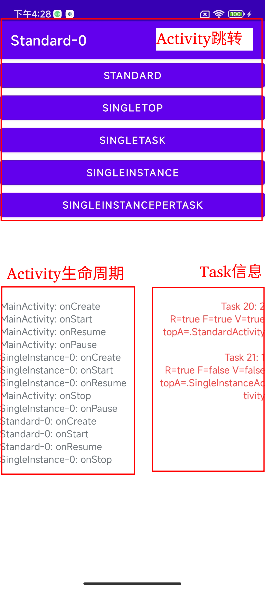

# ActivityLaunchMode

## 界面说明

### Activity跳转

共有5个button对应5种启动模式，点击后跳转到对应Activity，Activity标题由“启动模式+序列号”组成。

当Activity创建新的实例时，序列号会加1。

### Activity生命周期

打印每一个Activity生命周期函数回调。

### Task信息

每一个Task包含3行信息，分别对应：

第一行：Task ID： Activity数量
第二行：R是isRunning缩写，F是isFocused缩写，V是isVisible缩写。
第三行：topA是topActivity缩写，即前台Acitivity。